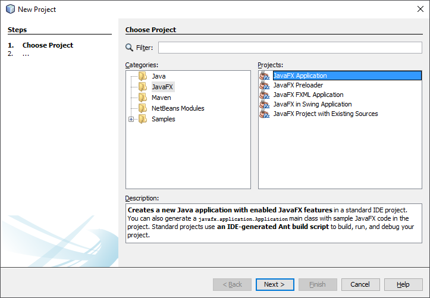

<!-- toc -->

# Application Structure

In general, a JavaFX application will have three major components namely Stage, Scene and Nodes as shown in the following diagram.

## Stage
A stage, in other GUI libraries often known as a Windows, contains all the objects of a JavaFX application. It is the top level container. The primary Stage is constructed by the platform. Additional Stage objects may be constructed by the application.

A stage has one of the following styles:

* StageStyle.DECORATED - a stage with a solid white background and platform decorations.
* StageStyle.UNDECORATED - a stage with a solid white background and no decorations.
* StageStyle.TRANSPARENT - a stage with a transparent background and no decorations.
* StageStyle.UTILITY - a stage with a solid white background and minimal platform decorations.
The style must be initialized before the stage is made visible.

## Scene
A scene represents the physical contents of a JavaFX application. It contains all the contents of a scene graph. A scene object is added to only one stage.

## Scene Graph and Nodes

A scene graph is a tree-like data structure (hierarchical) representing the contents of a scene. In contrast, a node is a visual/graphical object of a scene graph.

A node may include:

* Geometrical (Graphical) objects (2D and 3D) such as − Circle, Rectangle, Polygon, etc.
* UI Controls such as − Button, Checkbox, Choice Box, Text Area, etc.
* Containers (Layout Panes) such as Border Pane, Grid Pane, Flow Pane, etc.
* Media elements such as Audio, Video and Image Objects.

The Node Class represents a node in JavaFX, this class is the super class of all other above mentioned types of nodes.

Nodes can be categorized as follows:

* Root Node − The first Scene Graph is known as the Root node.

* Branch Node/Parent Node − The node with child nodes are known as branch/parent nodes. The abstract class named Parent of the package javafx.scene is the base class of all the parent nodes, and those parent nodes will be of the following types

  * Group − A group node is a collective node that contains a list of children nodes. Whenever the group node is rendered, all its child nodes are rendered in order. Any transformation, effect state applied on the group will be applied to all the child nodes.

  * Region − It is the base class of all the JavaFX Node based UI Controls, such as Chart, Pane and Control.

  * WebView − This node manages the web engine and displays its contents.

* Leaf Node − The node without child nodes is known as the leaf node. For example, Rectangle, Ellipse, Box, ImageView, MediaView, ...

## Hello World

It's time to begin our code journey with JavaFX. Let's try it out and create a simple "Hello World" application.

Create a new project in NetBeans and select "JavaFX => JavaFX Application" as project template.

Give the application a decent name such as 'JavaFX_HelloWorld'.

You can run the application by pressing the Run button. You will get a window with a single button. If you press it, a "Hello World" message will be printed to the console.

Congratulations, you just build your first JavaFX application.
