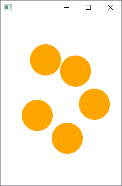
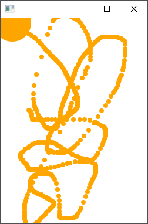

# Exercises

## Second Button

Take the hello world application and try adding a second button to the application that outputs "I am HAL" to the console when the user presses it.

If you make use of the StackPane only the last added button to the pane will be shown. That is why you should replace the StackPane with for example a FlowPane.

More information can be found @ https://docs.oracle.com/javase/8/javafx/api/javafx/scene/layout/FlowPane.html

## Say Hello

Take a look at http://docs.oracle.com/javafx/2/ui_controls/jfxpub-ui_controls.htm which contains a list of the controls available in JavaFX.

Make a small application that contains a text field where the user can type his name. Make sure to add a label in front of this textbox to make clear to the user that we expect him/her to type his/her name. Also add a button. You can use an HBox layout to put the label and the textfield together in a single container.

Print a message to the console that says hello to the user based on the name the user provided. Ex.: 'Hello Nico De Witte'.

## Make some Noise

Create a simple program with a single button that plays a sound.
You can make use of the Media and MediaPlayer classes. Best is to use mp3 sound files.

## An input Form

Create an input that asks the user for the following information:
* Firstname
* Lastname
* Nickname
* Password
* Password confirmation
* Submit button
* Labels for all fields

Make use of different layouts to create a decent GUI.

When the user presses the submit button a couple of things should happen:
* Check if the password and confirmation match
* Create a user object and put the information in this object
* Print the information to a label on the GUI using the toString() of the user object looking something similar as this:
```text
Nico De Witte
aka: BioBoost
Password: ***********
```

## Pointer Location Drawing

Create a small application that draws a circle on the scene when the user clicks on it. Draw the circle at the location of the mouse pointer at the time of clicking.

You can add an event filter to a scene, similar to an event handler that handles a button click. An example is given below.

```java
scene.addEventFilter(MouseEvent.MOUSE_PRESSED, new EventHandler<MouseEvent>() {
    @Override
    public void handle(MouseEvent mouseEvent) {
        System.out.println("mouse click detected! " + mouseEvent.getSource());
    }
});
```



## Pointer Dragging Drawing

Create a small application that draws a circle on the scene when the drags the mouse (holding the left button) on it. Draw the circle at the location of the mouse pointer at the time of clicking.

You can use a similar filter to the one of the previous program.



## Nine buttons keypad

Create an application that has 9 buttons ordered like a keypad as shown in the image below.


Simply output a message to the console that a button was pressed. You do not have to worry about identifying which button was actually pressed.
Make sure to create the nine buttons using a for-loop. Do not manually instantiate 9 buttons.
