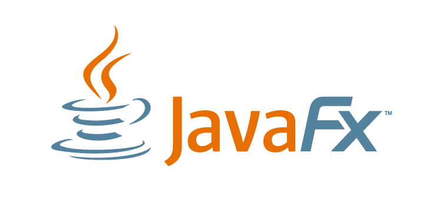
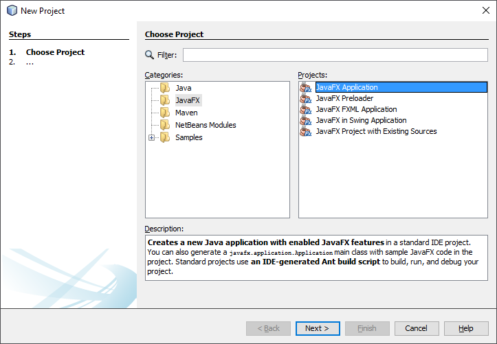
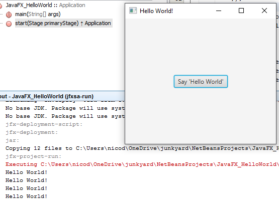

<!-- toc -->

# Background of JavaFX

To develop GUI (Graphical User Interface) applications, Java programmers use to rely on libraries such as AWT (Advanced Windowing Tool kit) and Swing. While these libraries did allow for quick development of GUI apps, they did however not always make life easy when developing applications that needed to run on all sorts of devices.

As of now JavaFX is becoming the standard when developing GUI applications with Java.

JavaFX is a GUI library for creating and delivering **desktop applications**, as well as **Rich Internet Applications (RIAs)** that can run across a wide variety of devices. JavaFX is intended to replace Swing as the standard GUI library for Java SE, but both will be included for the foreseeable future. JavaFX has support for desktop computers and web browsers on Microsoft Windows, Linux and MacOS.

## Rich Internet Applications

A Rich Internet application (RIA) is a Web application that has many of the characteristics of desktop application. It is typically delivered by way of a site-specific browser, a browser plug-in, an independent sandbox, extensive use of JavaScript, or a virtual machine.

Users generally need to install a software framework using the computer's operating system before launching the application, which typically downloads, updates, verifies and executes the RIA. This is the main differentiator from HTML5/JavaScript-based alternatives like Ajax that use built-in browser functionality to implement comparable interfaces.

In an RIA, the graphical presentation is handled on the client side, as it has a plugin that provides support for rich graphics. In a nutshell, data manipulation in an RIA is carried out on the server side, while related object manipulation is carried out on the client side.

Adobe Flash, JavaFX, and Microsoft Silverlight are currently the three most common platforms used to build RIAs.

### Adobe Flash

Adobe Flash manipulates vector and raster graphics to provide animation of text, drawings, and still images. It supports bidirectional streaming of audio and video, and it can capture user input via mouse, keyboard, microphone, and camera. Flash contains an object-oriented language called ActionScript and supports automation via the JavaScript Flash language (JSFL). Flash content may be displayed on various computer systems and devices, using Adobe Flash Player, which is available free of charge for common web browsers, some mobile phones and a few other electronic devices (using Flash Lite).

### Microsoft Silverlight

Silverlight was proposed by Microsoft as another proprietary alternative. The technology has not been widely accepted and, for instance, lacks support on many mobile devices. Silverlight is no longer under active development and is not supported in Microsoft Edge, Microsoft's most recent browser.

### JavaFX

JavaFX is a software platform for creating and delivering RIAs that can run across a wide variety of connected devices. The current release (JavaFX 8, July 2016) enables building applications for desktop, browser and mobile phones and comes with 3D support. RIA for mobile phones is called Rich Mobile Application. TV set-top boxes, gaming consoles, Blu-ray players and other platforms are planned. Java FX runs as plug-in Java Applet or via Webstart.

## Client Side applications

To develop Client Side Applications with rich features, the programmers used to depend on various libraries to add features such as Media, UI controls, Web, 2D and 3D, etc. JavaFX includes all these features in a single library. In addition to these, the developers can also access the existing features of a Java library such as Swings.

JavaFX provides a rich set of graphics and media API's and it leverages the modern Graphical Processing Unit (GPU) through hardware accelerated graphics. JavaFX also provides interfaces which developers can use to combine graphics animation and UI control.

JavaFX can be used with JVM based technologies such as Java, Groovy and JRuby.

## Key Features

Source: http://docs.oracle.com/javase/8/javafx/get-started-tutorial/jfx-overview.htm#A1131418

The following features are included in JavaFX 8 and later releases. Items that were introduced in JavaFX 8 release are indicated accordingly:

* **Java APIs:** JavaFX is a Java library that consists of classes and interfaces that are written in Java code. The APIs are designed to be a friendly alternative to Java Virtual Machine (Java VM) languages, such as JRuby and Scala.

* **FXML and Scene Builder:** FXML is an XML-based declarative markup language for constructing a JavaFX application user interface. A designer can code in FXML or use JavaFX Scene Builder to interactively design the graphical user interface (GUI). Scene Builder generates FXML markup that can be ported to an IDE where a developer can add the business logic.

* **WebView:** A web component that uses WebKitHTML technology to make it possible to embed web pages within a JavaFX application. JavaScript running in WebView can call Java APIs, and Java APIs can call JavaScript running in WebView. Support for additional HTML5 features, including Web Sockets, Web Workers, and Web Fonts, and printing capabilities have been added in JavaFX 8.

* **Swing interoperability:** Existing Swing applications can be updated with JavaFX features, such as rich graphics media playback and embedded Web content. The SwingNode class, which enables you to embed Swing content into JavaFX applications, has been added in JavaFX 8.

* **Built-in UI controls and CSS:** JavaFX provides all the major UI controls that are required to develop a full-featured application. Components can be skinned with standard Web technologies such as CSS. The DatePicker and TreeTableView UI controls are now available with the JavaFX 8 release. Also, the CSS Styleable classes have become public API, allowing objects to be styled by CSS.

* **Modena theme:** The Modena theme replaces the Caspian theme as the default for JavaFX 8 applications. The Caspian theme is still available for your use by adding the setUserAgentStylesheet(STYLESHEET_CASPIAN) line in your Application start() method.

* **3D Graphics Features:** The new API classes for Shape3D (Box, Cylinder, MeshView, and Sphere subclasses), SubScene, Material, PickResult, LightBase (AmbientLight and PointLight subclasses), and SceneAntialiasing have been added to the 3D Graphics library in JavaFX 8. The Camera API class has also been updated in this release.

* **Canvas API:** The Canvas API enables drawing directly within an area of the JavaFX scene that consists of one graphical element (node).

* **Printing API:** The javafx.print package has been added in Java SE 8 release and provides the public classes for the JavaFX Printing API.

* **Rich Text Support:** JavaFX 8 brings enhanced text support to JavaFX, including bi-directional text and complex text scripts, such as Thai and Hindu in controls, and multi-line, multi-style text in text nodes.

* **Multitouch Support:** JavaFX provides support for multitouch operations, based on the capabilities of the underlying platform.

* **Hi-DPI support:** JavaFX 8 now supports Hi-DPI displays.

* **Hardware-accelerated graphics pipeline:** JavaFX graphics are based on the graphics rendering pipeline (Prism). JavaFX offers smooth graphics that render quickly through Prism when it is used with a supported graphics card or graphics processing unit (GPU). If a system does not feature one of the recommended GPUs supported by JavaFX, then Prism defaults to the software rendering stack.

* **High-performance media engine:** The media pipeline supports the playback of web multimedia content. It provides a stable, low-latency media framework that is based on the GStreamer multimedia framework.

* **Self-contained application deployment model:** Self-contained application packages have all of the application resources and a private copy of the Java and JavaFX runtimes. They are distributed as native installable packages and provide the same installation and launch experience as native applications for that operating system.

## Developing JavaFX applications with NetBeans

From Java8 onwards, the JDK (Java Development Kit) includes the JavaFX library. Therefore, to run JavaFX applications, you simply need to install Java8 or later version on your system.

In addition IDE's such as NetBeans already provide support for developing applications with JavaFX.

Let's try it out and create a simple "Hello World" application.

Just create a new project in NetBeans and select "JavaFX => JavaFX Application" as project template.

Give the application a decent name such as 'JavaFX_HelloWorld'.

You can run the application by pressing the Run button. You will get a window with a single button. If you press it, a "Hello World" message will be printed to the console.

Congratulations, you just build your first JavaFX application.

## Understanding the JavaFX Architecture

The diagram below gives an overview of the JavaFX architecture and it's underlying components. The following sections briefly describe the different components and how the parts interconnect.

Below the JavaFX public APIs lies the engine that runs your JavaFX code. It is composed of subcomponents that include a JavaFX high performance graphics engine, called Prism; a small and efficient windowing system, called Glass; a media engine, and a web engine. Although these components are not exposed publicly, their descriptions can help you to better understand what runs a JavaFX application.

### Scene Graph

The JavaFX scene graph is the starting point for constructing a JavaFX application. It is a hierarchical tree of nodes that represents all of the visual elements of the application's user interface. It can handle input and can be rendered.

A node is a visual/graphical object and it may include −
* Geometrical (Graphical) objects − (2D and 3D) such as circle, rectangle, polygon, etc.
* UI controls − such as Button, Checkbox, Choice box, Text Area, etc.
* Containers − (layout panes) such as Border Pane, Grid Pane, Flow Pane, etc.
* Media elements − such as audio, video and image objects.

### Java Public APIs for JavaFX Features

The top layer of the JavaFX architecture provides a complete set of Java public APIs that support rich client application development. These APIs provide freedom and flexibility to construct rich client applications.

These Java APIs for JavaFX features:

* Allow the use of powerful Java features, such as generics, annotations, multithreading, and Lamda Expressions.

* Make it easier for Web developers to use JavaFX from other JVM-based dynamic languages, such as Groovy and JavaScript.

* Allow Java developers to use other system languages, such as Groovy, for writing large or complex JavaFX applications.

* Allow the use of binding which includes support for the high performance lazy binding, binding expressions, bound sequence expressions, and partial bind reevaluation. Alternative languages (like Groovy) can use this binding library to introduce binding syntax similar to that of JavaFX Script.

* Extend the Java collections library to include observable lists and maps, which allow applications to wire user interfaces to data models, observe changes in those data models, and update the corresponding UI control accordingly.

### Graphics System

The JavaFX Graphics System is an implementation detail beneath the JavaFX scene graph layer. It supports both 2-D and 3-D scene graphs. It provides software rendering when the graphics hardware on a system is insufficient to support hardware accelerated rendering.

Two graphics accelerated pipelines are implemented on the JavaFX platform:

* Prism processes render jobs. It can run on both hardware and software renderers, including 3-D. It is responsible for rasterization and rendering of JavaFX scenes. The fully hardware accelerated path is used when possible, but when it is not available, the software render path is used because the software render path is already distributed in all of the Java Runtime Environments (JREs). This is particularly important when handling 3-D scenes. However, performance is better when the hardware render paths are used.

* Quantum Toolkit ties Prism and Glass Windowing Toolkit together and makes them available to the JavaFX layer above them in the stack. It also manages the threading rules related to rendering versus events handling.

### Glass Windowing Toolkit

The Glass Windowing Toolkit is the lowest level in the JavaFX graphics stack. Its main responsibility is to provide native operating services, such as managing the windows, timers, and surfaces. It serves as the platform-dependent layer that connects the JavaFX platform to the native operating system.

### Media and Images

JavaFX media functionality is available through the javafx.scene.media APIs. JavaFX supports both visual and audio media. Support is provided for MP3, AIFF, and WAV audio files and FLV video files. JavaFX media functionality is provided as three separate components: the Media object represents a media file, the MediaPlayer plays a media file, and a MediaView is a node that displays the media.

The Media Engine component has been designed with performance and stability in mind and provides consistent behavior across platforms.

### Web Component

The Web component is a JavaFX UI control that provides a Web viewer and full browsing functionality through its API. This Web Engine component is based on WebKit, which is an open source web browser engine that supports HTML5, CSS, JavaScript, DOM, and SVG. It enables developers to implement the following features in their Java applications:

* Render HTML content from local or remote URL
* Support history and provide Back and Forward navigation
* Reload the content
* Apply effects to the web component
* Edit the HTML content
* Execute JavaScript commands
* Handle events

In addition, Java calls can be controlled through JavaScript and vice versa to allow developers to make the best of both environments.
