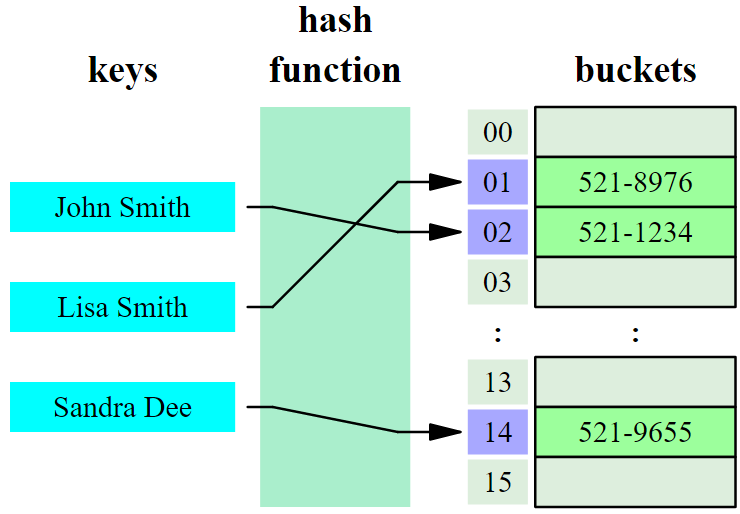

<!-- toc -->

# Collections

When processing data, it is often required to store multiple data values. These can
be of a primitive type or a more complex type such as objects.

While Java supports simple arrays, even multidimensional ones, it also contains what are known as collections.
Collections are special **dynamically sizeable** classes to store multiple data types. Each collection differs in its properties such as:
* allowing duplicate items
* being sequential or not
* integral indexing or hash indexing
* FIFO or LIFO types
* ....

## Arrays

When storing multiple items of the same data type this can often be accomplished using an array.
However an array is mostly only useful if you know in advance how many items you will need to store.

Let's take a look at a simple example where we store a number references to String objects in an array.

```java
final int SIZE = 3;
String[] list;              // list is null here
list = new String[SIZE];    // list contains 3 references to null
    // list now holds 3 items, this cannot be changed anymore
    // unless by creating a new array object

list[0] = "Hello";
list[1] = "from";
list[2] = "VIVES";

System.out.println(String.join(" ", list));
```

In the code above we first declare a local variable list of type `String[]` where the square brackets
indicate that list is a reference to an array object. Next we create an actual array object using the `new` operator.
Do not that all cells of the array contain null references after this operation. Ofcourse this can be written as a single
line of code

```java
String[] list = new String[SIZE];
```

Next String references are assigned to each index of the array. Last we print the elements using a *static* method
of the `String` class that joins all the elements in an array delimited with a specified delimiter (here a space).

Important properties to remember about arrays is that:
* they can only hold a single type (or subtypes of that type)
* their size is defined when creating the actual array using the `new` keyword
* If their data type is not a primitive type, the elements of the new array reference nothing (`null`) until you assign a reference to object to each cell


## Collections

A collection - sometimes called a container - is simply an object that groups multiple elements into a single unit. Collections are used to store, retrieve, manipulate, and communicate aggregate data. Typically, they represent data items that form a natural group, such as a poker hand (a collection of cards), a mail folder (a collection of letters), or a telephone directory (a mapping of names to phone numbers).

### A Collection Framework

Prior to Java 2, Java provided ad hoc classes such as Dictionary, Vector, Stack, and Properties to store and manipulate groups of objects. Although these classes were very useful, they lacked a central, unifying theme. Thus, the way that you used Vector was different from the way that you used Properties.

The collections framework was designed to meet several goals, such as
* The framework had to be high-performance. The implementations for the fundamental collections (dynamic arrays, linked lists, trees, and hashtables) were to be highly efficient.
* The framework had to allow different types of collections to work in a similar manner and with a high degree of interoperability.
* The framework had to extend and/or adapt a collection easily.

A collections framework is a unified architecture for representing and manipulating collections. All collections frameworks contain the following:
* **Interfaces**: These are abstract data types that represent collections. Interfaces allow collections to be manipulated independently of the details of their representation.
* **Implementations**: These are the concrete implementations of the collection interfaces. In essence, they are reusable data structures.
* **Algorithms**: These are the methods that perform useful computations, such as searching and sorting, on objects that implement collection interfaces. The algorithms are said to be polymorphic: that is, the same method can be used on many different implementations of the appropriate collection interface. In essence, algorithms are reusable functionality.

Towards this end, the entire collections framework is designed around a set of standard interfaces. Several standard implementations such as LinkedList, HashSet, and TreeSet, of these interfaces are provided that you may use as-is and you may also implement your own collection, if you choose.

In addition to collections, the framework defines several map interfaces and classes. Maps store key/value pairs. Although maps are not collections in the proper use of the term, but they are fully integrated with collections.

### Interfaces

The following list describes the core collection **interfaces**:

* **Collection**: the root of the collection hierarchy. A collection represents a group of objects known as its elements. The Collection interface is the least common denominator that all collections implement and is used to pass collections around and to manipulate them when maximum generality is desired. Some types of collections allow duplicate elements, and others do not. Some are ordered and others are unordered. The Java platform doesn't provide any direct implementations of this interface but provides implementations of more specific subinterfaces, such as Set and List.
* **Set**: a collection that cannot contain duplicate elements. This interface models the mathematical set abstraction and is used to represent sets, such as the cards comprising a poker hand, the courses making up a student's schedule, or the processes running on a machine.
* **List**: an ordered collection (sometimes called a sequence). Lists can contain duplicate elements. The user of a List generally has precise control over where in the list each element is inserted and can access elements by their integer index (position).
* **Queue**: a collection used to hold multiple elements prior to processing. Besides basic Collection operations, a Queue provides additional insertion, extraction, and inspection operations.
Queues typically, but do not necessarily, order elements in a FIFO (first-in, first-out) manner. Among the exceptions are priority queues, which order elements according to a supplied comparator or the elements' natural ordering. Whatever the ordering used, the head of the queue is the element that would be removed by a call to remove or poll. In a FIFO queue, all new elements are inserted at the tail of the queue. Other kinds of queues may use different placement rules. Every Queue implementation must specify its ordering properties.
* **Deque**: a collection used to hold multiple elements prior to processing. Besides basic Collection operations, a Deque provides additional insertion, extraction, and inspection operations.
Deques can be used both as FIFO (first-in, first-out) and LIFO (last-in, first-out). In a deque all new elements can be inserted, retrieved and removed at both ends.
* **Map**: an object that maps keys to values. A Map cannot contain duplicate keys; each key can map to at most one value. If you've used Hashtable, you're already familiar with the basics of Map.

### Implementations of the interfaces

Some general purpose implementations of the previous interfaces are:
* Set: HashSet, TreeSet, LinkedHashSet
* List: ArrayList, LinkedList
* Deque: ArrayDeque, LinkedList
* Map: HashMap, TreeMap, LinkedHashMap

Note that the `LinkedList` class implements both the `List` and the `Deque` interfaces. This can be verified at https://docs.oracle.com/javase/7/docs/api/java/util/LinkedList.html

The following paragraphs give an example of some of these implementations. However if you need to use a collection please refer to the oracle docs.

#### ArrayList

ArrayList is a resizable-array implementation of the List interface. It implements all optional list operations, and permits all elements, including null. In addition to implementing the List interface, this class provides methods to manipulate the size of the array that is used internally to store the list.

Let's take the same example as with the array but using an ArrayList:

```java
ArrayList words = new ArrayList();
    // Note that we do not need to specify the number of
    // elements that the ArrayList needs to hold.
    // It automatically expands

words.add("Hello");
words.add("from");
words.add("VIVES");

System.out.println(String.join(" ", words));
```

Note that the ArrayList will expand as needed. It also allows us to add `null` references and it **allows duplicates**.

```java
ArrayList words = new ArrayList();

words.add("Na");
words.add("Na");
words.add("Na");
words.add("Na");
words.add("Na");
words.add("Na");
words.add("Na");
words.add("Na");
words.add("Batman");

System.out.println(String.join(" ", words));
```

#### HashMap

In computing, a hash table (hash map) is a data structure which implements an associative array abstract data type, a structure that can map keys to values. A hash table uses a hash function to compute an index into an array of buckets or slots, from which the desired value can be found.

When you use lists and you are looking for a special item you normally have to iterate over the complete list. This is very expensive when you have large lists.
A hashtable can be a lot faster, under best circumstances you will get the item you are looking for with only one access.
How is it working? Like a dictionary ... when you are looking for the word "hashtable" in a dictionary, you are not starting with the first word under 'a'. But rather you go straight forward to the letter 'h'. Then to 'ha', 'has' and so on, until you found your word. You are using an index within your dictionary to speed up your search.

A hashtable does basically the same. Every item gets an unique index (the so called hash). You use this hash for lookups. The hash may be an index in a normal linked list. For instance your hash could be a number like 2130 which means that you should look at position 2130 in your list. A lookup at a known index within a normal list is very easy and fast.



The problem of the whole approach is the so called hash function which assigns this index to each item. When you are looking for an item you should be able to calculate the index in advance. Just like in a real dictionary, where you see that the word 'hashtable' starts with the letter 'h' and therefore you know the approximate position.
A good hash function provides hashcodes that are evenly distributed over the space of all possible hashcodes. And of course it tries to avoid collisions. A collision happens when two different items get the same hashcode.

Hash functions accept the object to be stored as an argument and generate a number that is unique to it. Different hashing functions have different trade-offs. A function that is too sparse will use up more space than required. While one that is not sparse enough will suffer from collisions where objects use the same hash.

When you start using hashtables you should always keep in mind, that you handle collisions correctly. It can happen quite easily in large hashtables that two objects got the same hash.

In Java, a HashMap is a hashtable based implementation of the Map interface. This implementation provides all of the optional map operations, and permits null values and the null key. This class makes no guarantees as to the order of the map; in particular, it does not guarantee that the order will remain constant over time.

```java
HashMap<String, Color> colors = new HashMap();

colors.put("red", Color.RED);
colors.put("lime", Color.LIME);
colors.put("green", Color.GREEN);
colors.put("blue", Color.BLUE);
colors.put("pink", Color.PINK);
colors.put("black", Color.BLACK);
colors.put("white", Color.WHITE);
colors.put(null, Color.BLACK);

Color drawingColor = colors.get("red");
// ....
```

Note that it is best practice to specify the type of your keys and values using the diamond operators `<>` as shown above.

### Pass interfaces, not implementations

As a rule, you should be thinking about the interfaces, not the implementations. For the most part, the choice of implementation affects only performance. The preferred style is to choose an implementation when a Collection is created and to immediately assign the new collection to a variable of the corresponding interface type (or to pass the collection to a method expecting an argument of the interface type). In this way, the program does not become dependent on any added methods in a given implementation, leaving the programmer free to change implementations anytime that it is warranted by performance concerns or behavioral details.

Bad:
```java
void foo(ArrayList list) {
  // ....
}
```

Good:
```java
void foo(List list) {
  // ....
}
```

Why? Because List is the interface type and allows a user of your method to create his/her own implementation of this List interface. If you pass an ArrayList he/she would only be able to create a subclass of ArrayList, which might not be an option or a bad design choice. This is what interfaces are made for, so use them for this purpose.

## Foreach - An enhanced for-loop

[todo]
