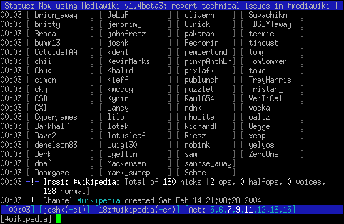
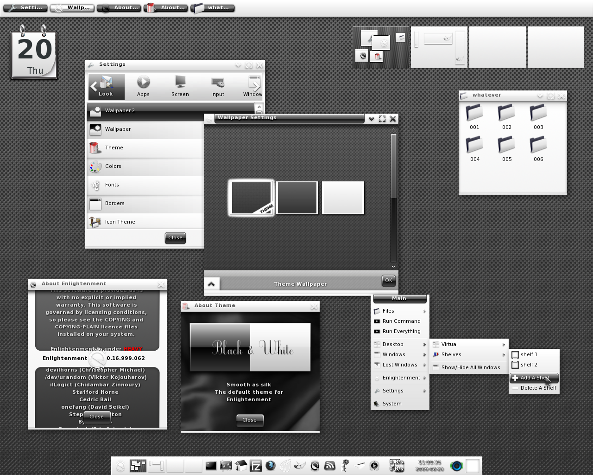

<!-- toc -->

# Introduction

Today a lot of different software applications exists. Most can be grouped in one of the following categories based on their front-end:

* Console applications have no graphical user interfaces and are created to run in a terminal. While user interaction does exist, this is mostly limited to textual interaction.
* Headless applications or daemons have no graphical interfaces and are run as processes that run in the background. Interaction may be possible through mechanisms such as RPC (Remote Procedure Calls), Sockets, System calls, ...
* Graphical applications do have a graphical user interface. It allows users to interact with it through a windowing system and user controls that fire events when user interactions occurs.

## Console Applications
A console application is a computer program designed to be used via a text-only computer interface, such as a text terminal, the command line interface of some operating systems (Unix, DOS, etc.) or the text-based interface included with most Graphical User Interface (GUI) operating systems, such as the Win32 console in Microsoft Windows.

A user typically interacts with a console application using only a keyboard and display screen. Many console applications such as command line interpreters are command line tools, but numerous text-based user interface (TUI) programs also exist.

As the speed and ease-of-use of GUIs applications have improved over time, the use of console applications has greatly diminished, but not disappeared. Some users simply prefer console based applications, while some organizations still rely on existing console applications to handle key data processing tasks.

The generation of console applications is kept as a feature of modern programming environments such as Visual Studio and the .NET Framework on Microsoft Windows because it greatly simplifies the learning process of a new programming language by removing the complexity of a graphical user interface.

For data processing tasks and computer administration, these programming environments represent the next level of operating system or data processing control after scripting. If an application is only going to be run by the original programmer and/or a few colleagues, there may be no need for a pretty graphical user interface, leaving the application leaner, faster and easier to maintain.

## Daemon Applications

In multitasking computer operating systems, a daemon is a computer program that runs as a background process, rather than being under the direct control of an interactive user. For example, syslogd is the daemon that implements the system logging facility, and sshd is a daemon that serves incoming SSH connections.

Systems often start daemons at boot time which will respond to network requests, hardware activity, or other programs by performing some task. Daemons such as cron may also perform defined tasks at scheduled times.

The term was coined by the programmers of MIT's Project MAC. They took the name from Maxwell's demon, an imaginary being from a thought experiment that constantly works in the background, sorting molecules. Unix systems inherited this terminology. Maxwell's Demon is consistent with Greek mythology's interpretation of a daemon as a supernatural being working in the background, with no particular bias towards good or evil.

Alternate terms for daemon are service (used in Windows and later also in Linux), started task (IBM z/OS) and ghost job (XDS UTS).

Daemons which connect to a computer network are examples of network services.

## GUI Applications

The graphical user interface (GUI), is a type of user interface that allows users to interact with electronic devices through graphical icons and visual indicators such as secondary notation, instead of text-based user interfaces, typed command labels or text navigation. GUIs were introduced in reaction to the perceived steep learning curve of command-line interfaces (CLIs), which require commands to be typed on a computer keyboard.

The actions in a GUI are usually performed through direct manipulation of the graphical elements. Beyond computers, GUIs are used in many handheld mobile devices such as MP3 players, portable media players, gaming devices, smartphones and smaller household, office and industrial controls. The term GUI tends not to be applied to other lower-display resolution types of interfaces, such as video games (where heads-up display (HUD) is preferred), or not including flat screens, like volumetric displays because the term is restricted to the scope of two-dimensional display screens able to describe generic information, in the tradition of the computer science research at the Xerox Palo Alto Research Center (PARC).

Designing the visual composition and temporal behavior of a GUI is an important part of software application programming in the area of human–computer interaction. Its goal is to enhance the efficiency and ease of use for the underlying logical design of a stored program, a design discipline named **usability**. Methods of user-centered design are used to ensure that the visual language introduced in the design is well-tailored to the tasks.

The visible graphical interface features of an application are sometimes referred to as chrome or GUI. Typically, users interact with information by manipulating visual widgets that allow for interactions appropriate to the kind of data they hold. The widgets of a well-designed interface are selected to support the actions necessary to achieve the goals of users. A model–view–controller allows a flexible structure in which the interface is independent from and indirectly linked to application functions, so the GUI can be customized easily. This allows users to select or design a different skin at will, and eases the designer's work to change the interface as user needs evolve. Good user interface design relates to users more, and to system architecture less.

Large widgets, such as windows, usually provide a frame or container for the main presentation content such as a web page, email message or drawing. Smaller ones usually act as a user-input tool.

By the 1990s, cell phones and handheld game systems also employed application specific touchscreen GUIs. Newer automobiles use GUIs in their navigation systems and multimedia centers, and/or navigation multimedia center combinations.
